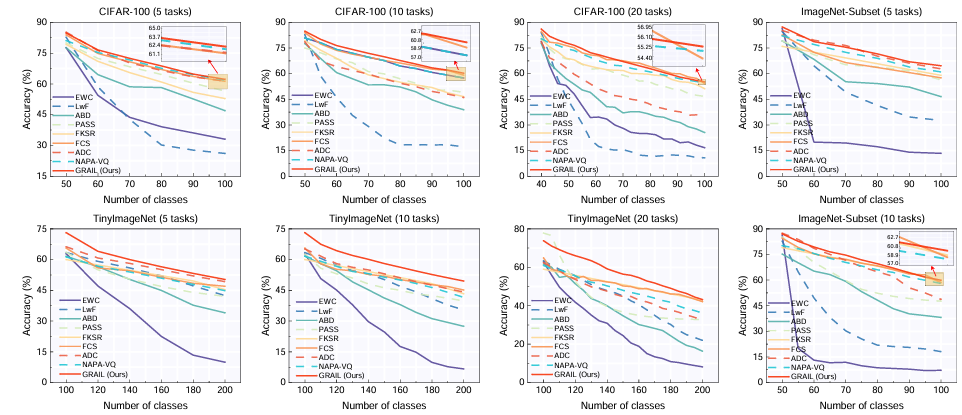

## GRAIL: Granularity Adaptive Representation for Class-Incremental Learning with Granular-ball

[](https://github.com/yaoyao-liu/class-incremental-learning/blob/master/LICENSE) [](https://www.python.org/) [](https://pytorch.org/)

This repository provides the official implementation of the study titled "Granularity Adaptive Representation for Class-Incremental Learning with Granular-Ball," concisely named GRAIL.

## How To Use

### Clone

Clone this GitHub repository:

```
git clone https://github.com/AldrinLake/GRAIL.git
cd GRAIL
```

## Requirements

- Python 3.7
- CUDA 11.1
- PyTorch 1.8.2 + cu111, torchvision 0.9.2 + cu111, torchaudio 0.8.2

Alternatively, create the environment directly from the YAML file:

```bash
conda env create -f grail.yml
conda activate grail
```

## Datasets

This code uses the dataset wrappers from `utils/data.py` (e.g., CIFAR-100). Datasets will be downloaded automatically to the default directory if not present.

## Quick start

1) Edit experiment config:

- Modify `exps/grail_CIFAR100.json` for dataset, model, and training settings.

2) Run example:

```bash
python main_for_CIFAR100_warm_first.py
python main_for_CIFAR100_warm_second.py
```

The complete implementation will be released once the paper is accepted.

Results are stored under `results/<dataset>/<init_cls>_<increment>/GRAIL.xlsx`. Model checkpoints and granular-ball data are stored under `model_param_saved/`.

## Configuration highlights

- `init_cls`, `increment`: task schedule for incremental learning
- Optimization: `init_lr`, `lrate`, `milestones`, `weight_decay`
- Loss weights: `w_old_cls`, `w_cont`, `w_trsf`
- Data: `batch_size`, `num_workers`, `dataset`, `seed`
- Model saving and reuse: `use_past_model`, `save_model`, `model_dir`

## Reproduced Results

###### Classification accuracy of NECIL methods on CIFAR-100, TinyImageNet,  and ImageNet-Subset under the warm-start setting.



###### Module ablation results under the 5-task split in the warm-start setting.


## License

This code is released for review purpose only. All rights reserved.

## Acknowledgments

We gratefully acknowledge the continual learning framework and resources provided by [PyCIL](https://github.com/LAMDA-CL/PyCIL).
